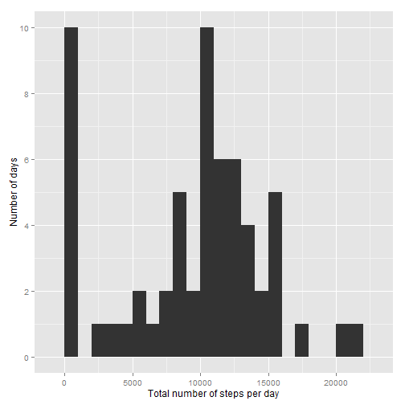
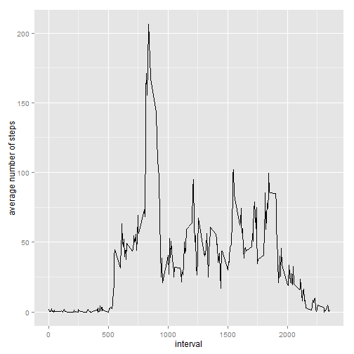
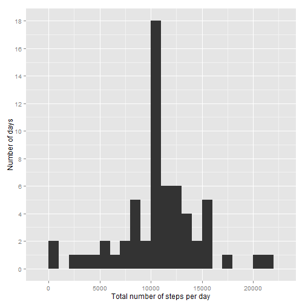

# Reproducible Research: Peer Assessment 1

## Loading and preprocessing the data

```r
unzip("repdata%2Fdata%2Factivity.zip")
```

```
## Warning in unzip("repdata%2Fdata%2Factivity.zip"): error 1 in extracting
## from zip file
```

```r
data<-read.table("activity.csv",header=TRUE,sep=",",stringsAsFactors=FALSE, dec=".")
```
Open libraries

```r
library(date)
library(ggplot2)
library(stringr)
library(knitr)
library(rmarkdown)
```

## What is mean total number of steps taken per day?

```r
data$date<-as.factor(data$date)
suma<-tapply(data$steps,data$date,sum,na.rm=TRUE)
psuma<-qplot(suma,xlab="Total number of steps per day",ylab="Number of days",binwidth=1000)
psuma+scale_y_continuous(breaks=c(0,2,4,6,8,10))
```

 

```r
mean(suma)
```

```
## [1] 9354.23
```

```r
median(suma)
```

```
## [1] 10395
```

## What is the average daily activity pattern?

```r
avg<-aggregate(x=list(steps_avg=data$steps),by=list(interval=data$interval), FUN=mean, na.rm=TRUE)
ggplot(avg,aes(x=interval,y=steps_avg))+geom_line()+ylab("average number of steps")+xlab("interval")
```

 
On average, the 5-minute interval, across all the days in the dataset, that contains the maximum number of steps is:

```r
str_pad(avg[which.max(avg$steps_avg),1], width = 4, side = "left", pad = 0)
```

```
## [1] "0835"
```

## Imputing missing values
The number of missings in the dataset only affects to the column steps. 

```r
table(is.na(data$steps))
```

```
## 
## FALSE  TRUE 
## 15264  2304
```
The new dataset created, data_all, with the NA filled in is the following:

```r
data_all<-data
for (i in 1:nrow(data_all)){
  if (is.na(data_all[i,1])){
    data_all[i,1]<-avg$steps_avg[which(avg$interval==data_all[i,3])]
  }
}
```
The following code will plot the new histogram, and the new mean and median. This values increase, because the days with all 
step values NA, were computed as if the steps were 0. This way, those values are substituted by the mean day, so the 
new mean and median are higher.

```r
data_all$date<-as.factor(data_all$date)
sum2<-tapply(data_all$steps,data_all$date,sum,na.rm=TRUE)
psum2<-qplot(sum2,xlab="Total number of steps per day",ylab="Number of days",binwidth=1000)
psum2+scale_y_continuous(breaks=c(0,2,4,6,8,10,12,14,16,18))
```

 

```r
mean(sum2)
```

```
## [1] 10766.19
```

```r
median(sum2)
```

```
## [1] 10766.19
```

## Are there differences in activity patterns between weekdays and weekends?
The lenguage is spanish, so those day appear, sábado and domingo, corresponding to saturday and sunday

```r
data_all$date<-as.Date(as.character(data_all$date),format="%Y-%m-%d")
data_all$week<-weekdays(data_all$date)
for (i in 1:nrow(data_all)){
  if (data_all[i,4]%in%c("sábado","domingo"))
    data_all[i,4]<-"Weeekend"
  else data_all[i,4]<-"Weekday" 
}
```
The following plot shows the differences between workdays and weekends

```r
data_all$week<-as.factor(data_all$week)
weeks<-aggregate(x=list(steps_week=data_all$steps),by=list(week=data_all$week,interval=data_all$interval), FUN=mean, na.rm=TRUE)
ggplot(weeks,aes(x=interval,y=steps_week))+facet_grid(week~.)+geom_line()+ylab("average number of steps")+xlab("interval")
```

 
